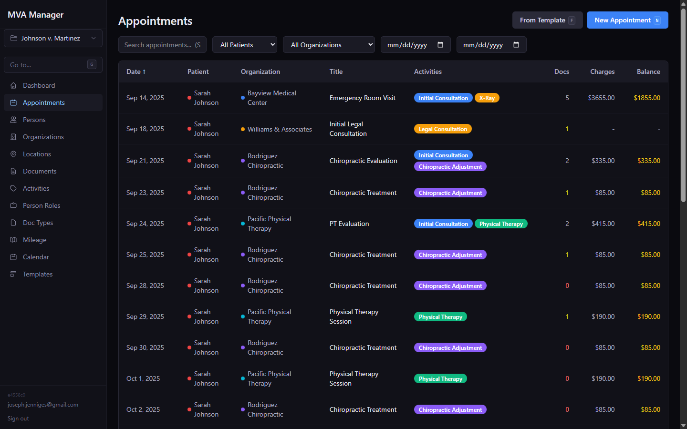
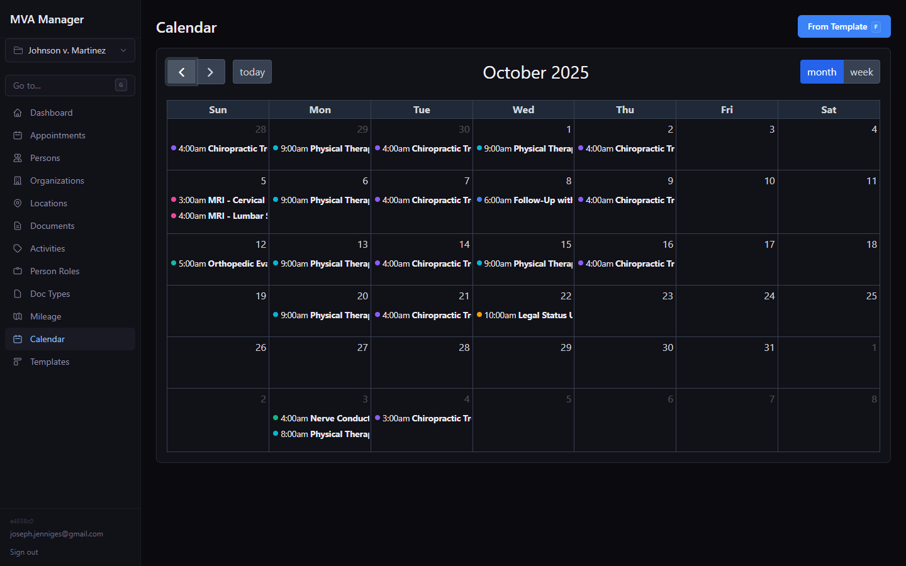
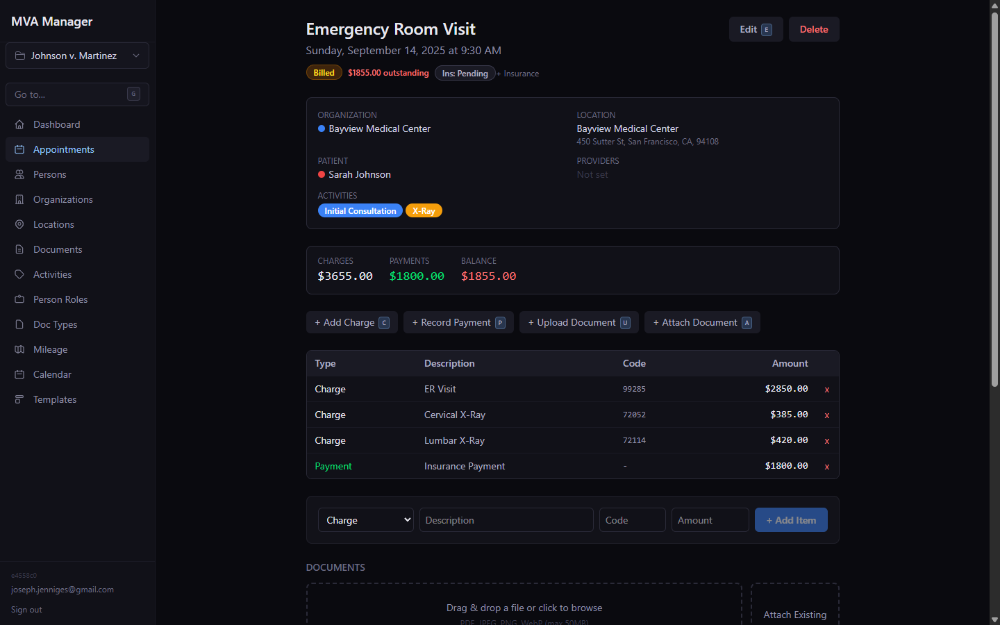
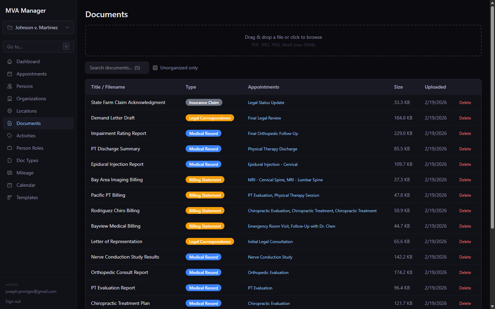
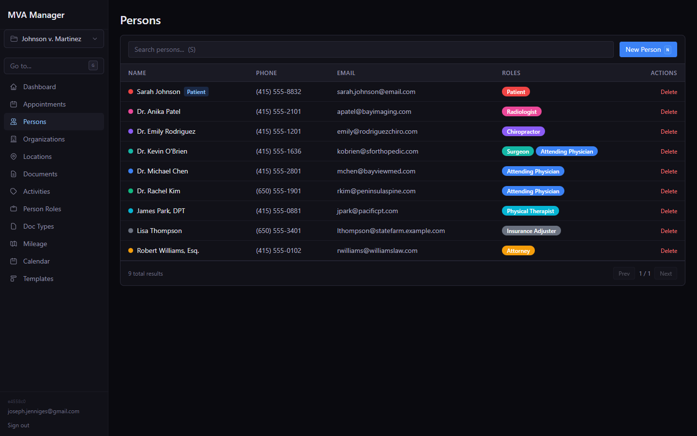
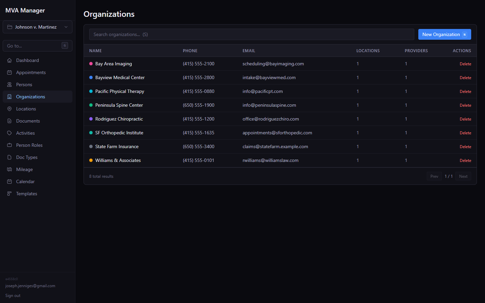
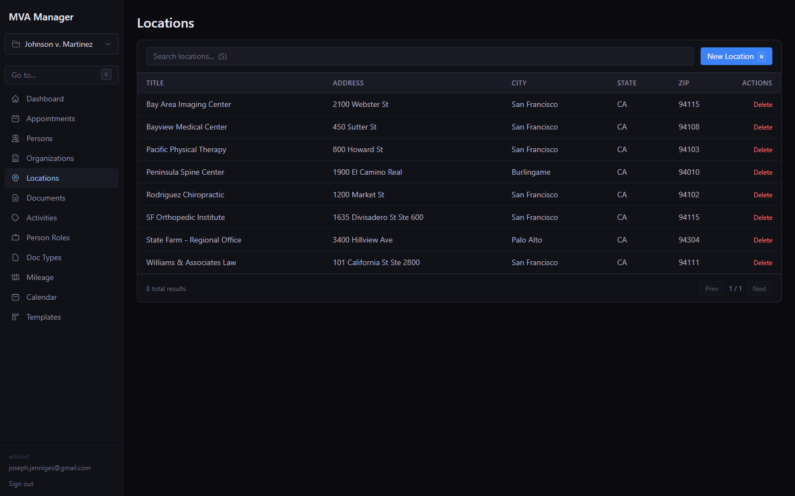
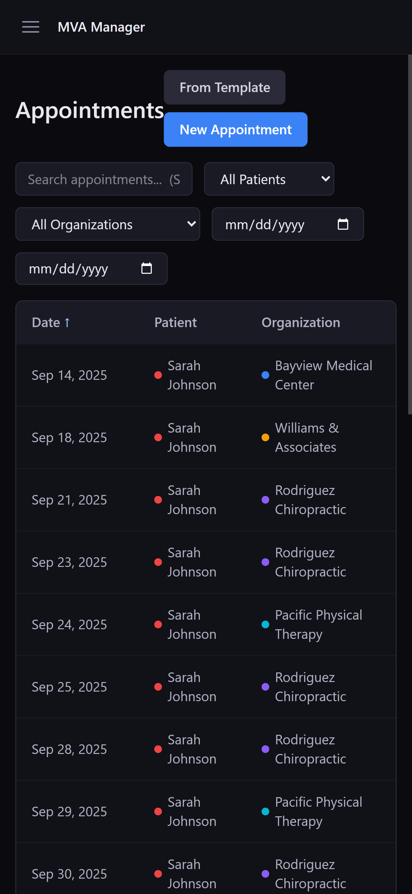

# mva-manager

A web app for managing the documentation lifecycle after a motor vehicle accident:
doctor visits, providers, billing, insurance paperwork, and mileage reimbursement — all
organized per case.

It tracks the people, organizations, locations, and appointments involved in a case,
stores the associated documents (bills, explanations of benefits, imaging, insurance
cards) with an inline PDF/image viewer, and computes driving-distance reimbursement
between the patient's home and each provider.

## Features

- **Case-scoped workspaces** — each accident case ("event") groups its own people,
  providers, appointments, documents, and charges. Per-case role-based access control.
- **Appointments & calendar** — month and week views (FullCalendar), recurring
  appointments, and saved templates for quickly adding the visits you book repeatedly.
- **People & organizations** — patients, physicians, chiropractors, PTs, attorneys,
  adjusters, etc., with color-coded role tags, contact info, and notes.
- **Documents** — drag-and-drop upload with document-type naming templates
  (e.g. `{Patient} {DocumentType} {Organization}`), inline PDF viewer (pdf.js), and
  the ability to share one document across multiple appointments (one EOB → many visits).
- **Billing** — aggregate charges plus itemized line items with billing/charge codes
  from explanations of benefits, grouped with payments.
- **Mileage reimbursement** — driving distance to each provider and back home, computed
  via Geocodio (with a local OSRM option), aggregated into per-case totals.
- **Maps** — each appointment shows its location on a map (Leaflet) with a one-tap
  "open in GPS" action on mobile.
- **Reports** — generate PDF summary reports of charges and mileage (jsPDF).
- **Address autocomplete** — Mapbox-backed address entry.
- **Keyboard-driven** — command palette and keyboard shortcuts for fast navigation.
- **Google sign-in** — OAuth login restricted to an allow-list of emails. Responsive,
  dark-theme UI (Tailwind).

## Screenshots

| Appointments | Calendar |
| --- | --- |
|  |  |

| Appointment detail | Documents |
| --- | --- |
|  |  |

| People | Organizations |
| --- | --- |
|  |  |

| Locations | Mobile |
| --- | --- |
|  |  |

## Tech stack

- **Backend:** Node 20+ / Express 5, Drizzle ORM, PostgreSQL, Zod, Pino
- **Frontend:** React 19 + Vite SPA, Tailwind CSS, React Router, FullCalendar, Leaflet, pdf.js
- **Auth:** Google OAuth (`google-auth-library`, `@react-oauth/google`)
- **Geo:** Geocodio (geocoding + driving distance), Mapbox (autocomplete), optional self-hosted OSRM
- **Deploy:** Docker + Docker Compose

## Getting started

```bash
# 1. Install dependencies
npm install

# 2. Configure environment
cp .env.example .env
# then fill in DATABASE_URL, Google OAuth, and API keys as needed

# 3. Create the schema
npm run db:push

# 4. (Optional) Load demo case data
npm run db:seed

# 5. Run the API + client in watch mode
npm run dev
```

The dev server runs the Express API and the Vite client together. For local development
you can skip Google OAuth by setting `VITE_DEV_AUTH_BYPASS=true` in `.env`.

### Demo data

`npm run db:seed` (or `node seed.mjs`) wipes the target database and loads a sample case
("Johnson v. Martinez") with providers, appointments, charges, and mileage so you can
explore the app without entering data by hand. It connects using `DATABASE_URL`, so point
that at the database you want to populate — **it deletes existing data first.**

## Deployment

Production runs as two containers (app + Postgres) via `docker-compose.prod.yml`, behind
an Nginx reverse proxy handling SSL. An example proxy config is provided at
`deploy/nginx-mva.example.com.conf` — swap in your own domain and certificate paths.
See `.env.example` for the required variables (`POSTGRES_PASSWORD`, Google OAuth
credentials, `GEOCODIO_API_KEY`, `MAPBOX_TOKEN`, etc.).
